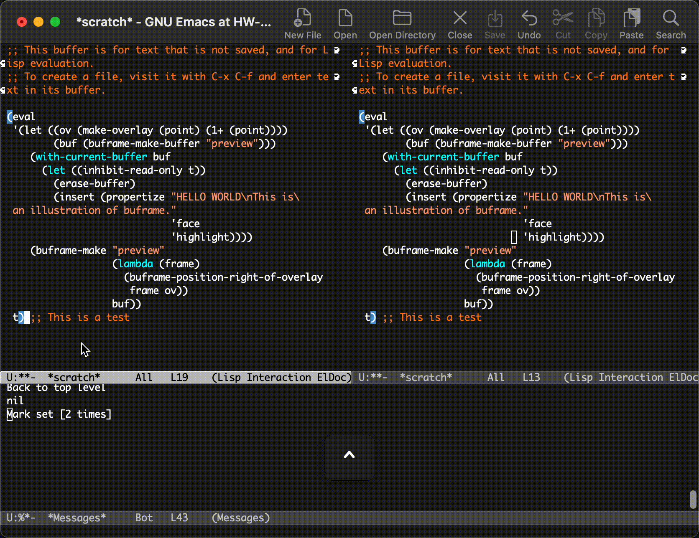

# buframe.el - Buffer-local frames for Emacs

Buframe provides utilities for creating and managing lightweight child frames
associated with individual buffers. These frames are meant for inline previews,
annotations, completions, or other UI elements that should not interfere with
normal Emacs focus or window behaviour.



## Features

- Buffer-local child frames
- Minimal appearance (no mode-line, tool-bar, tab-bar, etc.)
- Non-focusable, non-disruptive
- Dynamically positioned relative to buffer content (e.g. overlays, regions)
- Automatic update and hide/show depending on buffer selection
- Debounced frame updates to avoid flicker
- Dedicated buffers configured for preview-only use

## Installation

`buframe` is available from GNU ELPA. You can install it directly via `M-x package-install RET buframe RET`.

## Usage

Example creating a child frame next to an overlay:

```emacs-lisp
(eval
 '(let ((ov (make-overlay (point) (1+ (point))))
        (buf (buframe-make-buffer "preview")))
    (with-current-buffer buf
      (let ((inhibit-read-only t))
        (erase-buffer)
        (insert (propertize "HELLO WORLD\nThis is an illustration of buframe."
                            'face
                            'highlight))))
    (buframe-make "preview"
                  (lambda (frame)
                    (buframe-position-right-of-overlay frame ov))
                  buf))
 t) ;; This is a test
```

Frames will automatically update/hide as the buffer is selected/deselected.

## Comparison with posframe

`buframe` was inspired by [corfu](https://github.com/minad/corfu)'s frames,
which were in turn inspired by posframes. The main difference lies in the
scope and the buffer integration. Buframes are auto-updated/hidden on buffer
selection.

Buframe is better suited when frames need to *track* and *belong* to a buffer
(e.g. inline annotations or previews). Posframe is simpler when you just want
to display a popup at point.
